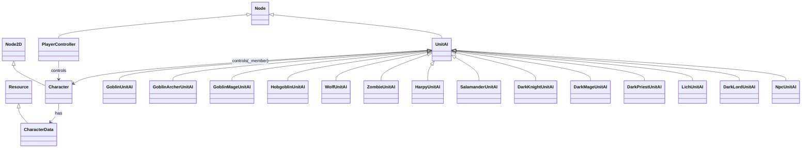
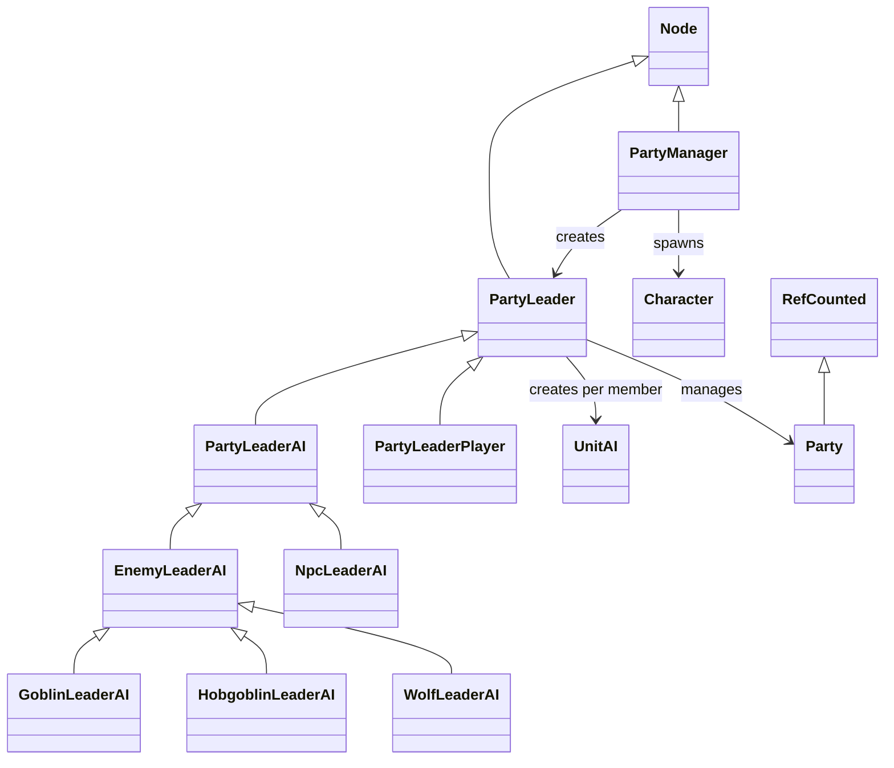
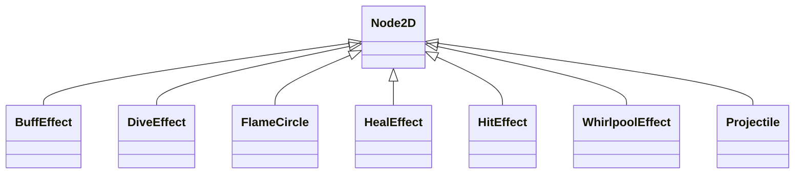

# クラス構成と役割分担の可視化（2026-04-18）

> scripts/ 配下の GDScript クラス構造を俯瞰し、責務の重複・曖昧さを
> 浮き彫りにする。今後の設計判断（特に Player/AI 計算統一・特殊
> 行動実装の責務分離）の材料とする。

## 結論サマリー

- 全体の階層は**概ね整っている**（`Party*` / `UnitAI` / `Character` の 3 層）が、**UnitAI と PlayerController の機能重複**と **Character への責務集中**が最大の課題
- `unit_ai.gd` が **2409 行**まで肥大化し、「意思決定」「実処理」「特殊攻撃 6 種」「ポーション管理」「経路探索」を抱え込んでいる
- `character.gd` は **1309 行** で「データ」「表示」「戦闘計算」「ログ出力」「エフェクト生成」など責務過多
- `DarkLordUnitAI` だけ「意思決定 + 実処理 + パラメータ」を完全自前で持つ唯一のサブクラス（他は性格フックのみ）
- **推奨: (b) 軽微〜中規模のリファクタリング**。`CombatCalculator`（共通戦闘計算）と `SkillExecutor`（V スロット実行）の 2 モジュール抽出で大半の課題が解消する

---

## 1. クラス階層図

### 1-1. キャラクター系



### 1-2. パーティー系



### 1-3. エフェクト・アクション系



### 1-4. UI / ゲームロジック系

```mermaid
classDiagram
    Node2D <|-- GameMap : メインシーン
    CanvasLayer <|-- LeftPanel
    CanvasLayer <|-- RightPanel
    CanvasLayer <|-- MessageWindow
    CanvasLayer <|-- ConsumableBar
    CanvasLayer <|-- DebugWindow
    CanvasLayer <|-- DialogueWindow
    CanvasLayer <|-- NpcDialogueWindow
    CanvasLayer <|-- HUD
    CanvasLayer <|-- TimeStopOverlay
    CanvasLayer <|-- ConfigEditor
    CanvasLayer <|-- AreaNameDisplay

    RefCounted <|-- MapData
    RefCounted <|-- DungeonBuilder
    RefCounted <|-- CharacterGenerator
    RefCounted <|-- SaveData

    Node <|-- GlobalConstants : Autoload
    Node <|-- SoundManager : Autoload
    Node <|-- SaveManager : Autoload
    Node <|-- MessageLog : Autoload
    Node <|-- VisionSystem
    Node <|-- CameraController
    Node <|-- DialogueTrigger
```



### 1-5. クラス規模サマリー（行数降順トップ 15）

| 行数 | クラス | 役割（1 行） |
|---:|---|---|
| 2591 | `ConfigEditor` | 開発用定数エディタ（編集・JSON 読書・タブ UI 全て） |
| 2420 | `GameMap` | メインシーン：タイル描画・シーン初期化・入力ハンドラ・フロア遷移 |
| **2409** | **`UnitAI`** | **個体 AI：意思決定・行動キュー・攻撃実行・6 種の V 攻撃** |
| 2162 | `PlayerController` | プレイヤー操作：入力処理・攻撃実行・V 攻撃 6 種・アイテム UI |
| 1689 | `OrderWindow` | 指示・ステータスウィンドウ |
| **1309** | **`Character`** | **キャラクター本体：HP/energy・ダメージ計算・ログ・エフェクト生成** |
| 883 | `PartyLeader` | パーティー戦略決定・指示配布・戦況評価 |
| 772 | `DebugWindow` | デバッグ情報表示 |
| 652 | `MessageWindow` | 戦闘メッセージ表示 |
| 599 | `NpcLeaderAI` | NPC パーティーリーダー AI（フロア遷移判断・自動装備等） |
| 549 | `ConsumableBar` | 消耗品 UI |
| ~~547~~ | ~~`BaseAI`~~ | **2026-04-19 に物理削除済み（Legacy LLM AI）** |
| 516 | `PartyManager` | パーティー管理・スポーン |
| 511 | `CharacterGenerator` | キャラクター生成・ステータス計算 |
| 505 | `GlobalConstants` | Autoload 定数 |

**規模異常の最大候補**: `UnitAI`（2409 行） / `Character`（1309 行） / `PlayerController`（2162 行）

---

## 2. 責務マトリクス

### 凡例
- 🔴 主責務（メインで担当）
- 🟡 部分担当（一部のロジックを持つ）
- ⚪ 関与せず

### 意思決定系

| 責務 | `UnitAI` | `PartyLeader` | `PartyLeaderAI`/NpcLeaderAI | `Character` | `PlayerController` |
|---|:-:|:-:|:-:|:-:|:-:|
| パーティー戦略（ATTACK/FLEE/WAIT） | ⚪ | 🔴 | 🔴 | ⚪ | ⚪ |
| ターゲット選択 | 🟡 | 🔴 | 🔴 | ⚪ | 🔴（操作キャラのみ）|
| 発動タイミング判定（V 攻撃等） | 🔴 | ⚪ | ⚪ | ⚪ | ⚪ |
| 移動判断（A\*・フロア遷移） | 🔴 | 🟡（move_policy 配信） | 🟡 | ⚪ | 🔴（入力反映）|
| 回復対象選定 | 🔴 | ⚪ | ⚪ | ⚪ | 🟡（TARGETING 候補）|
| 戦況判断（CombatSituation） | ⚪ | 🔴 | 🔴 | ⚪ | ⚪ |

### 実行系（ダメージ・効果適用）

| 責務 | `UnitAI` | `Character` | `PlayerController` | エフェクト系 |
|---|:-:|:-:|:-:|:-:|
| 通常攻撃ダメージ計算 | 🔴（AI） | 🔴（`take_damage` 側）| 🔴（Player） | ⚪ |
| 回復実行 | 🔴（AI） | 🔴（`heal` メソッド）| 🔴（Player） | ⚪ |
| V 攻撃実行（6 種） | 🔴（AI） | 🟡（`apply_stun` / `apply_defense_buff` 提供）| 🔴（Player） | ⚪ |
| ワープ（dark-lord） | 🟡（`DarkLordUnitAI` のみ）| ⚪ | ⚪ | ⚪ |
| エフェクト生成 | 🟡 | 🟡（`_spawn_hit_effect`）| 🟡 | 🔴 |
| SE 再生 | 🟡 | 🟡 | 🟡 | ⚪ |
| スプライト・アニメ制御 | ⚪ | 🔴 | 🟡（ターゲット照準）| ⚪ |

### 管理系（状態・所持品）

| 責務 | `Character` | `CharacterData` | `UnitAI` | `PartyManager`/Leader |
|---|:-:|:-:|:-:|:-:|
| HP/energy 増減 | 🔴 | ⚪ | ⚪ | ⚪ |
| 状態ラベル更新（healthy 等） | 🔴（`get_condition`）| ⚪ | ⚪ | ⚪ |
| 装備管理 | 🟡（`refresh_stats_from_equipment`）| 🔴（slot 保持・bonus 計算）| ⚪ | 🟡（NPC 自動装備）|
| インベントリ | ⚪ | 🔴 | 🟡（ポーション検索）| 🟡（自動受渡） |
| 攻撃タイマー（PRE/POST） | 🟡 | ⚪ | 🔴（ステートマシン） | ⚪ |

---

## 3. 責務の重複・曖昧さ

### 3-1. 🔴 最大の問題：Player/AI 完全二重実装

[unit_ai.gd](scripts/unit_ai.gd) と [player_controller.gd](scripts/player_controller.gd) に **同じ計算が独立して書かれている**：

| 処理 | UnitAI 側 | PlayerController 側 |
|---|---|---|
| melee 攻撃 | `_execute_attack` 内 `melee` ケース | `_execute_melee` |
| ranged 攻撃 | `_execute_attack` 内 `ranged`/`magic` ケース | `_execute_ranged` |
| 突進斬り | `_v_rush_slash` | `_execute_rush` |
| 振り回し | `_v_whirlwind` | `_execute_whirlwind` |
| ヘッドショット | `_v_headshot` | `_execute_headshot` |
| 炎陣 | `_v_flame_circle` | `_execute_flame_circle` |
| 無力化水魔法 | `_v_water_stun` | `_execute_water_stun` |
| スライディング | `_v_sliding` | `_execute_sliding` |
| 回復 | `_start_action "heal"` | `_execute_heal` |
| バフ | `_start_action "buff"` | `_execute_buff` |

本セッションで判明した乖離バグ（heal_mult 未適用・stun_duration ハードコード・flame_circle パラメータ無視）はすべてこの二重実装が原因。**最優先で共通化すべき**。

### 3-2. 🟠 DarkLordUnitAI だけ異質

他の 13 種の `UnitAI` サブクラスは「性格フック」（`obedience` / `_should_self_flee` / `_should_ignore_flee` / `_can_attack` / `_get_path_method` / `_on_after_attack`）しか持たない。`DarkLordUnitAI` のみ：
- 独自の `_process` オーバーライド（ワープタイマー）
- 独自の `_do_warp` / `_find_warp_destination` / `_place_flame_circle` メソッド
- パラメータ 5 個を `const` ハードコード（JSON 参照なし）

**継承方針が一貫していない**。詳細は `docs/investigation_enemy_v_slot.md` 参照。

### 3-3. 🟠 Character への責務集中（1309 行）

現在の Character には以下が同居：
- **データ保持**：hp / energy / facing / grid_pos
- **スプライト制御**：_tex_top / walk1/walk2/ready/guard / アニメ
- **戦闘計算**：`take_damage` 本体（防御判定・耐性・クリティカル）
- **スキル受付**：`apply_stun` / `apply_defense_buff` / `heal`
- **バトルメッセージ生成**：`_emit_damage_battle_msg`（8 種類の分岐）
- **方向・距離計算**：`_calc_attack_direction`
- **ログ出力**：`log_heal` / `_log_damage`
- **エフェクト生成**：`_spawn_hit_effect` / `_spawn_stun_effect` 他

データ層とビュー層が分離されていない。

### 3-4. 🟡 PartyLeader と UnitAI の移動判断が重複気味

- `PartyLeader._assign_orders()` が各メンバーに `move_policy` を配布
- `UnitAI._generate_move_queue()` が `move_policy` を解釈して行動決定
- さらに `UnitAI._generate_queue()` 冒頭でクロスフロア追従判定を独自実行

意思決定がレイヤー跨ぎで行われており、「誰がどこまで決めるか」が読みづらい。

### 3-5. 🟢 責務が明確な系統（問題なし）
- `Party` / `PartyManager` / `PartyLeader` 系統 → 階層が整理されている
- エフェクト系（`*_effect.gd` / `Projectile` / `FlameCircle`）→ 各々単一責任
- UI 系（`OrderWindow` / `ConsumableBar` / `MessageWindow`）→ 役割が明確
- Autoload 系（`GlobalConstants` / `SoundManager` / `SaveManager` / `MessageLog`）→ 疎結合

---

## 4. 特殊行動の実装パターン分析

### 4-1. 炎陣（magician-fire の V）
| 要素 | 場所 | パラメータ源 |
|---|---|---|
| 発動判定（AI）| `unit_ai.gd:_generate_special_attack_queue` の `magician-fire` ケース | `GlobalConstants.SPECIAL_ATTACK_FIRE_ZONE_*` |
| 発動判定（Player）| `player_controller.gd:_enter_pre_delay` → `_execute_flame_circle` | 直接発動（プレイヤー入力）|
| 実処理（AI）| `unit_ai.gd:_v_flame_circle` | `CharacterData.v_duration` / `v_tick_interval` |
| 実処理（Player）| `player_controller.gd:_execute_flame_circle` | `slot_data.get("duration", ...)` |
| エフェクト | `FlameCircle.new()` + `flame.setup()` | 両者から呼ぶ |

### 4-2. 炎陣（dark-lord・別実装）
| 要素 | 場所 | パラメータ源 |
|---|---|---|
| 発動判定 | `DarkLordUnitAI._process`（3 秒タイマー）| `const WARP_INTERVAL` |
| 実処理 | `DarkLordUnitAI._place_flame_circle` | **全て `const` ハードコード** |
| ダメージ | **固定値 4**（`FLAME_DAMAGE` const）| `power` と無関係 |
| エフェクト | `FlameCircle.new()` | magician-fire と共通 |

### 4-3. スタン（magician-water の V）
| 要素 | 場所 | パラメータ源 |
|---|---|---|
| 発動判定（AI）| `unit_ai.gd:_generate_special_attack_queue` | ターゲット存在＋非スタン |
| 実処理（AI）| `unit_ai.gd:_v_water_stun` → `target.apply_stun` | `CharacterData.v_duration` |
| 実処理（Player）| `player_controller.gd:_execute_water_stun` → `Projectile` 経由 | `slot_data.get("duration")` |
| エフェクト | `WhirlpoolEffect` + `Character._stun_effect` | `Character.apply_stun` 内で生成 |
| 状態管理 | `Character.is_stunned` / `stun_timer` | `Character._process` で消化 |

### 4-4. 防御バフ（healer の V）
| 要素 | 場所 | パラメータ源 |
|---|---|---|
| 発動判定（AI）| `unit_ai.gd:_generate_buff_queue` | `_should_use_special_skill()`・`_find_buff_target` |
| 発動判定（Player）| `player_controller.gd` の V キー入力 | 直接 |
| 実処理 | 両側とも `target.apply_defense_buff(duration)` | `CharacterData.v_duration` / `slot_data.duration` |
| エフェクト | `BuffEffect` | `Character.apply_defense_buff` 内で生成 |
| 状態管理 | `Character.defense_buff_timer` | `Character._process` で消化 |
| **numeric 効果** | **現在なし**（base_defense 廃止で名目上のバフ）| — |

### 4-5. ワープ（dark-lord）
| 要素 | 場所 | パラメータ源 |
|---|---|---|
| 発動判定 | `DarkLordUnitAI._process`（3 秒タイマー）| `const WARP_INTERVAL`・`game_speed` |
| 実処理 | `DarkLordUnitAI._do_warp` → `_member.grid_pos = dest` + `sync_position()` | `const WARP_RANGE` |
| ワープ先決定 | `DarkLordUnitAI._find_warp_destination` | `MapData.is_walkable` + `_is_occupied` |
| 後続処理 | ワープ直後に `_place_flame_circle` 呼び出し | 1 セット発動 |

### 4-6. アンデッド特効（healer の Z）
| 要素 | 場所 | パラメータ源 |
|---|---|---|
| 発動判定（AI）| `unit_ai.gd:_generate_heal_queue` → `_find_undead_target` | `CharacterData.is_undead` |
| 実処理（AI）| `unit_ai.gd:_start_action "heal"` 内でアンデッド分岐 | `CharacterData.power`・`z_damage_mult` |
| 実処理（Player）| `player_controller.gd:_execute_heal` 内でアンデッド分岐 | `slot_data.damage_mult` |
| ダメージ計算 | `power × ATTACK_TYPE_MULT[magic] × z_damage_mult` | 両者で同式（本セッションで統一済み）|
| メッセージ | `character.gd:_emit_damage_battle_msg` の `attack_type == "heal" and is_undead` 分岐 | 「聖なる光」演出 |

### 4-7. 降下攻撃（harpy）
| 要素 | 場所 | パラメータ源 |
|---|---|---|
| 発動判定 | `UnitAI._can_attack_target`（attack_type=dive の範囲判定）| `CharacterData.attack_type` / `is_flying` |
| 実処理 | `unit_ai.gd:_execute_attack` の `dive` ケース | `ATTACK_TYPE_MULT[dive]` |
| エフェクト | `DiveEffect.new()` | `unit_ai.gd:_spawn_dive_effect` |
| `HarpyUnitAI` の役割 | **性格フックのみ**（特殊行動なし） | — |

### 総括：特殊行動実装パターンの整理

| 行動 | 実行コード | パラメータ源 | AI/Player 統一度 |
|---|---|---|:-:|
| 通常 melee | UnitAI / PlayerController | CharacterData / slot | 🔴 別実装 |
| 通常 ranged | UnitAI / PlayerController | CharacterData / slot | 🔴 別実装 |
| ranged dive | UnitAI（Player は発動なし）| CharacterData | 🟢（AI のみ）|
| 突進斬り | UnitAI / PlayerController | 両方 slot 参照（cost は数値一致） | 🔴 別実装 |
| 振り回し | UnitAI / PlayerController | 同上 | 🔴 別実装 |
| ヘッドショット | UnitAI / PlayerController | 同上 | 🔴 別実装 |
| 炎陣（mage-fire）| UnitAI / PlayerController | CharacterData / slot | 🔴 別実装（本セッションで JSON 駆動化）|
| 炎陣（dark-lord）| DarkLordUnitAI | **const ハードコード** | 🟢 AI のみ（独自）|
| 無力化水魔法 | UnitAI / PlayerController | CharacterData / slot | 🔴 別実装（本セッションで JSON 駆動化）|
| 防御バフ | UnitAI / PlayerController | CharacterData / slot | 🔴 別実装（本セッションで JSON 駆動化）|
| スライディング | UnitAI / PlayerController | slot（cost のみ）| 🔴 別実装 |
| 回復 | UnitAI / PlayerController | CharacterData.z_heal_mult / slot | 🔴 別実装（本セッションで統一計算式）|
| アンデッド特効 | 同上（heal 内分岐）| 同上 | 🔴 別実装（本セッションで統一計算式）|
| ワープ | DarkLordUnitAI | const | 🟢 AI のみ（独自）|

---

## 5. 推奨構造案

### 判定: **(b) 軽微〜中規模のリファクタリング**

全体階層は整っており、責務境界も概ね妥当。しかし「**AI/Player 二重実装**」と「**Character の肥大化**」を解消しないと、本セッションで起きた乖離バグ（heal_mult / duration 系）が今後も発生する。以下 3 つのリファクタリングを推奨：

### 推奨 A: `SkillExecutor`（仮称）の抽出 — 最優先・効果大

V スロット 6 種＋通常 Z の 10 種類の重複実装を共通化：

```gdscript
# scripts/skill_executor.gd（新設）
class_name SkillExecutor
extends RefCounted

static func execute_melee(attacker: Character, target: Character,
        slot: Dictionary) -> void: ...
static func execute_ranged(attacker: Character, target: Character,
        slot: Dictionary, map_node: Node) -> void: ...
static func execute_heal(caster: Character, target: Character,
        slot: Dictionary) -> void: ...
static func execute_rush_slash(caster: Character, slot: Dictionary) -> void: ...
static func execute_whirlwind(caster: Character, slot: Dictionary) -> void: ...
static func execute_flame_circle(caster: Character, slot: Dictionary,
        map_node: Node, all_members: Array) -> void: ...
# 等…
```

- PlayerController / UnitAI は「いつ・誰に」だけ決めて `SkillExecutor` を呼ぶ
- `slot` は統一された Dictionary（旧 `slot_data` / `CharacterData.v_*` 両対応）
- 共通化されれば計算式の乖離は構造的に発生しなくなる
- 作業量: **M（中）** 実作業 1〜2 日程度

### 推奨 B: `CombatCalculator` の抽出 — 優先中

Character 内の戦闘計算を静的メソッド群に切り出し：

```gdscript
class_name CombatCalculator
extends RefCounted

static func calc_base_damage(power: int, atype: String,
        damage_mult: float) -> int: ...
static func roll_critical(attacker: Character) -> bool: ...
static func calc_block(defender: Character, attacker: Character,
        is_magic: bool) -> int: ...
static func calc_resistance(defender: Character, is_magic: bool) -> float: ...
static func final_damage(raw: int, blocked: int, resistance: float) -> int: ...
```

- `Character.take_damage` は上記を組み合わせる薄いラッパーに
- 将来テスト可能（単体テストを書きやすい）
- 作業量: **S（小）** 実作業 半日〜1 日

### 推奨 C: `DarkLordUnitAI` の JSON 駆動化 — 優先低（可読性向上）

`const WARP_INTERVAL` / `FLAME_DAMAGE` 等を `dark-lord.json` の `slots.V` 経由に：

```json
"V": {
    "action": "warp_flame",
    "interval": 3.0,
    "range": 2,
    "damage": 4,
    "duration": 3.0,
    "tick_interval": 0.5
}
```

- `CharacterData` に `v_interval` / `v_damage` 等を追加
- `DarkLordUnitAI` は CharacterData 参照に置き換え
- ボス系キャラが今後増える場合の足がかりになる
- 作業量: **S（小）** 実作業 半日

### 推奨しないもの

- **Character のフル分割**（データ/ビュー/戦闘）：既存コードの広範囲に影響するため労力対効果が悪い。`CombatCalculator` 抽出だけで十分
- **UnitAI サブクラスの全統合**：サブクラスは薄いフックだけの存在なので統合の意義が薄い。現状維持で OK
- ~~**旧 LLM AI（`BaseAI` / `EnemyAI` / `LLMClient` / `DungeonGenerator` / `GoblinAI`）削除**：本件の範囲外だが、legacy 棚卸しとして別途候補~~
  - **→ 2026-04-19 に完了**。5 クラス（約 1,221 行）＋ `CharacterData.create_hero()` / `create_goblin()` dead method を物理削除

### 実施順の推奨
1. **推奨 A（SkillExecutor）を先行**：本セッションで繰り返し出てきたバグを構造的に解消する
2. **推奨 B（CombatCalculator）を続けて**：A で整理された Skill 実装を、さらに計算式単位で純化する
3. **推奨 C（DarkLord JSON 駆動化）は Phase 14 のバランス調整と合わせて**：調整したい値が JSON にあると便利

---

## 付録：ファイル一覧（責務ラベル付き）

### 意思決定系（大）
- `unit_ai.gd` (2409): 個体 AI
- `party_leader.gd` (883): 戦略・指示配布
- `npc_leader_ai.gd` (599): NPC 固有判断
- `party_manager.gd` (516): スポーン・ライフサイクル

### 実行・データ系
- `character.gd` (1309): キャラクター本体
- `character_data.gd` (384): データコンテナ
- `character_generator.gd` (511): 生成・ステータス計算

### プレイヤー入力
- `player_controller.gd` (2162): 入力・攻撃・V 攻撃・アイテム UI
- `dialogue_trigger.gd` (145): 会話トリガー

### UI
- `order_window.gd` (1689): 指示・ステータス
- `consumable_bar.gd` (549): 消耗品バー
- `left_panel.gd` (339) / `right_panel.gd` (248): パネル
- `message_window.gd` (652): メッセージ
- `debug_window.gd` (772): デバッグ
- `config_editor.gd` (2591): 定数編集
- `main_menu.gd` / `pause_menu.gd` / `title_screen.gd` 等: メニュー系
- `dialogue_window.gd` / `npc_dialogue_window.gd`: 会話 UI

### エフェクト系
- `flame_circle.gd` (155): 炎陣
- `hit_effect.gd` (152): ヒット
- `projectile.gd` (128): 飛翔体
- `buff_effect.gd` (39): バフ
- `dive_effect.gd` (38): 降下
- `heal_effect.gd` (60): 回復
- `whirlpool_effect.gd` (60): 渦（スタン）

### 敵 UnitAI サブクラス（全 14 種）
- 性格フックのみ：goblin / goblin_archer / goblin_mage / hobgoblin / wolf / zombie / harpy / salamander / dark_knight / dark_mage / dark_priest / lich / npc（13 種）
- **独自実装あり**：`dark_lord_unit_ai.gd`（119 行・ワープ+炎陣）

### リーダー AI
- `enemy_leader_ai.gd` (46): 敵共通
- `npc_leader_ai.gd` (599): NPC 自律
- `goblin_leader_ai.gd` (33) / `hobgoblin_leader_ai.gd` (21) / `wolf_leader_ai.gd` (32): 種族差分
- `party_leader_player.gd` (76): プレイヤーパーティー
- `party_leader_ai.gd` (21): AI 共通基底

### マップ・ダンジョン
- `game_map.gd` (2420): メインシーン
- `map_data.gd` (236): タイルデータ
- `dungeon_builder.gd` (268): 構築
- `vision_system.gd` (265): 視界
- `camera_controller.gd` (100): カメラ
- `area_name_display.gd` (98): エリア名

### Autoload
- `global_constants.gd` (505): 定数
- `sound_manager.gd` (179): SE
- `save_manager.gd` (90): セーブ
- `message_log.gd` (109): ログ

### その他
- `hud.gd` (50) / `time_stop_overlay.gd` (35) / `target_cursor.gd` (6)

### Legacy（削除済み）
2026-04-19 に以下 5 ファイル（約 1,221 行）を物理削除。詳細は [docs/history.md](history.md) の 2026-04-19 エントリ参照：
- ~~`base_ai.gd` (547)~~: 旧 LLM AI 基底
- ~~`enemy_ai.gd` (401)~~: 旧 LLM 敵 AI
- ~~`goblin_ai.gd` (45)~~: 旧 LLM ゴブリン
- ~~`llm_client.gd` (109)~~: LLM クライアント
- ~~`dungeon_generator.gd` (119)~~: 旧 LLM ダンジョン生成
